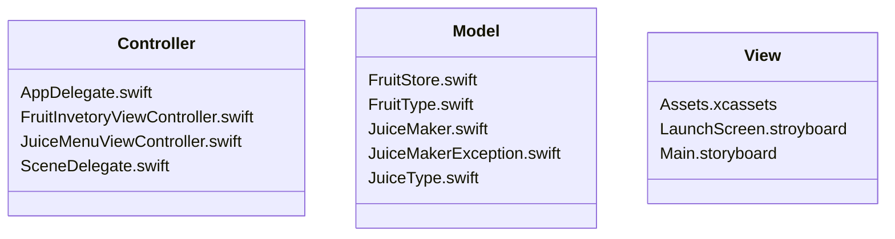
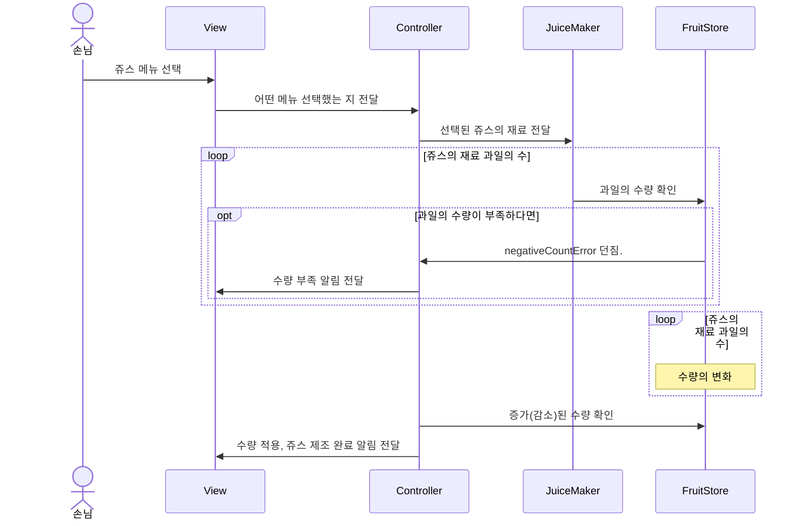
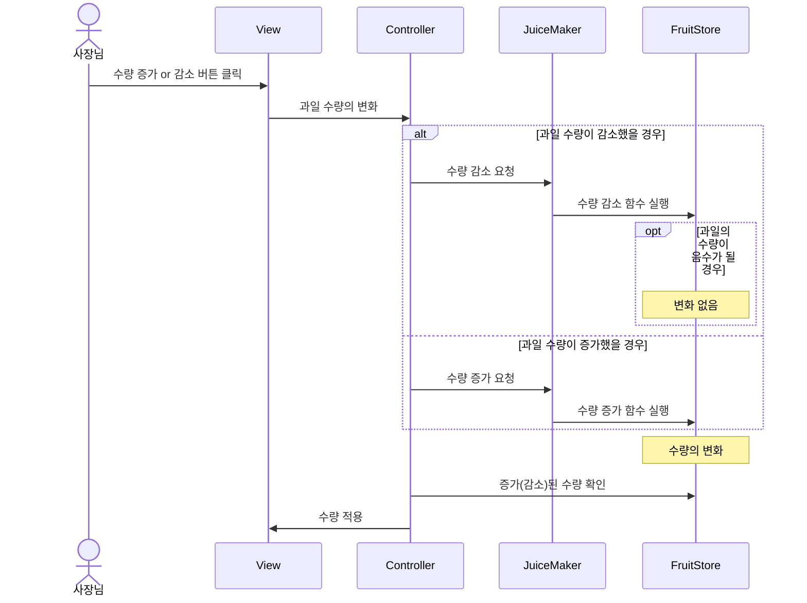

# ios-juice-maker🧃
쥬스메이커 프로젝트 저장소입니다. 

## 팀원:busts_in_silhouette:

| 프로필 사진 |  |  |
| ---- | ----------- | --------- |
| in Github | [@newJunsung](https://github.com/newJunsung) | [@JJong](https://github.com/shlim0) |
| in SeSAC | 뉴준성 | JaeHyeok |

## 폴더 구조:file_folder:

## 흐름도:ocean:
- **쥬스 선택**

- **과일 수량 증감**

